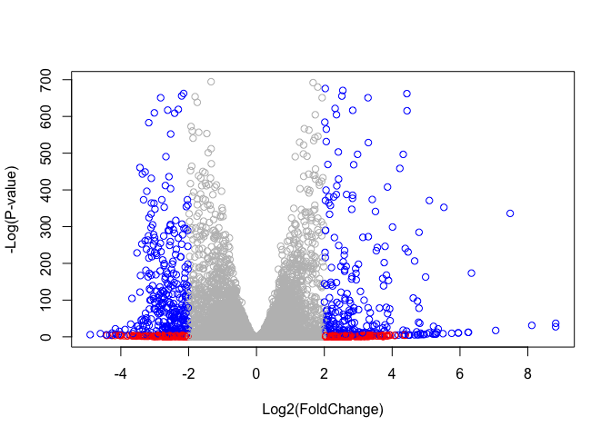

Class15
================
Xuerui HUang
5/22/2019

# Load Packages

# load and Process Data

``` r
metaFile <- "GSE37704_metadata.csv"
countFile <- "GSE37704_featurecounts.csv"

# Import metadata and take a peak
colData = read.csv(metaFile, row.names=1)
head(colData)
```

    ##               condition
    ## SRR493366 control_sirna
    ## SRR493367 control_sirna
    ## SRR493368 control_sirna
    ## SRR493369      hoxa1_kd
    ## SRR493370      hoxa1_kd
    ## SRR493371      hoxa1_kd

``` r
# Import countdata
countData = read.csv(countFile, row.names=1)
head(countData)
```

    ##                 length SRR493366 SRR493367 SRR493368 SRR493369 SRR493370
    ## ENSG00000186092    918         0         0         0         0         0
    ## ENSG00000279928    718         0         0         0         0         0
    ## ENSG00000279457   1982        23        28        29        29        28
    ## ENSG00000278566    939         0         0         0         0         0
    ## ENSG00000273547    939         0         0         0         0         0
    ## ENSG00000187634   3214       124       123       205       207       212
    ##                 SRR493371
    ## ENSG00000186092         0
    ## ENSG00000279928         0
    ## ENSG00000279457        46
    ## ENSG00000278566         0
    ## ENSG00000273547         0
    ## ENSG00000187634       258

Process
Data

``` r
# Remove length column to make sure the row and column number are the same
countData$length <- NULL

# remove the rows that all rows are zero
countData <- countData[rowSums(countData)>0,]
head(countData)
```

    ##                 SRR493366 SRR493367 SRR493368 SRR493369 SRR493370
    ## ENSG00000279457        23        28        29        29        28
    ## ENSG00000187634       124       123       205       207       212
    ## ENSG00000188976      1637      1831      2383      1226      1326
    ## ENSG00000187961       120       153       180       236       255
    ## ENSG00000187583        24        48        65        44        48
    ## ENSG00000187642         4         9        16        14        16
    ##                 SRR493371
    ## ENSG00000279457        46
    ## ENSG00000187634       258
    ## ENSG00000188976      1504
    ## ENSG00000187961       357
    ## ENSG00000187583        64
    ## ENSG00000187642        16

# DESeq

## Running DESeq

``` r
dds <-  DESeqDataSetFromMatrix(countData=countData,
                             colData=colData,
                             design=~condition)
dds <-  DESeq(dds)
```

    ## estimating size factors

    ## estimating dispersions

    ## gene-wise dispersion estimates

    ## mean-dispersion relationship

    ## final dispersion estimates

    ## fitting model and testing

``` r
res <-  results(dds) %>% as.data.frame(.)

summary(res) # 4396 genes, which is 28% of the total genes, are down regulated
```

    ##     baseMean        log2FoldChange          lfcSE        
    ##  Min.   :     0.1   Min.   :-4.902884   Min.   :0.03163  
    ##  1st Qu.:    12.1   1st Qu.:-0.459361   1st Qu.:0.07507  
    ##  Median :   214.8   Median : 0.008707   Median :0.13108  
    ##  Mean   :  1002.1   Mean   : 0.015164   Mean   :0.60432  
    ##  3rd Qu.:   774.3   3rd Qu.: 0.508047   3rd Qu.:0.53867  
    ##  Max.   :399481.5   Max.   : 8.822085   Max.   :4.08047  
    ##                                                          
    ##       stat               pvalue             padj       
    ##  Min.   :-52.97126   Min.   :0.00000   Min.   :0.0000  
    ##  1st Qu.: -2.34434   1st Qu.:0.00000   1st Qu.:0.0000  
    ##  Median :  0.05028   Median :0.02204   Median :0.0163  
    ##  Mean   : -0.08060   Mean   :0.24012   Mean   :0.2300  
    ##  3rd Qu.:  2.22749   3rd Qu.:0.47941   3rd Qu.:0.4411  
    ##  Max.   : 48.42078   Max.   :0.99997   Max.   :1.0000  
    ##                                        NA's   :1237

## Making plot based on the result

``` r
# Plot volcano plot
plot( res$log2FoldChange, -log(res$padj) )
```

<!-- -->

``` r
# plot more advanced verison of volcano plot
# Make a color vector for all genes
mycols <- rep("gray", nrow(res) )

# Color red the genes with absolute fold change above 2
mycols[ abs(res$log2FoldChange) > 2 ] <- "red"

# Color blue those with adjusted p-value less than 0.01
#  and absolute fold change more than 2
inds <- (res$padj<0.01) & (abs(res$log2FoldChange) > 2 )
mycols[ inds ] <- "blue"

plot( res$log2FoldChange, -log(res$padj), col=mycols, xlab="Log2(FoldChange)", ylab="-Log(P-value)" )
```

<!-- -->

## Get annotation of DESeq Genes

``` r
library("AnnotationDbi")
```

    ## 
    ## Attaching package: 'AnnotationDbi'

    ## The following object is masked from 'package:dplyr':
    ## 
    ##     select

``` r
library("org.Hs.eg.db")
```

    ## 

``` r
anno_info_Hs <- AnnotationDbi::select(org.Hs.eg.db, keys=rownames(res), 
                                      columns=c("SYMBOL","ENTREZID","GENENAME"), keytype="ENSEMBL",multiVals="first")
```

    ## 'select()' returned 1:many mapping between keys and columns

``` r
res <- merge(res,anno_info_Hs,by.x = "row.names",by.y = "ENSEMBL")
colnames(res)[8:10] <- c("symbol","entrez","name")
#column_to_rownames(res,"Row.names")

# output DESeq genes to a file named deseq_results.csv
res = res[order(res$pvalue),]
write.csv(res,"deseq_results.csv")
```

# KEGG pathways

## Load Packages
